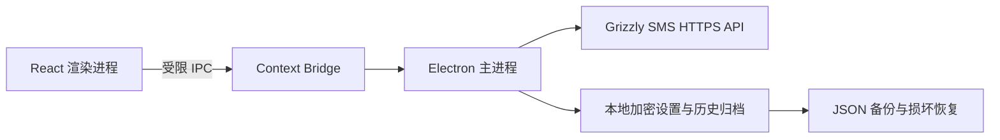

# Grizzly SMS Desktop

面向 Windows 与 macOS 的 Grizzly SMS 桌面客户端，用于查询余额、搜索服务和国家、租用号码、接收验证码、管理激活状态，以及保存本地历史归档。

项目基于 Electron、React 和 TypeScript 构建，API Key 只在 Electron 主进程中使用，并通过操作系统安全存储加密保存。

> 当前版本：`0.3.2`
>
> 平台：Windows x64、macOS Intel、macOS Apple Silicon
>
> API：[Grizzly SMS Client API](https://api.grizzlysms.com/docs/client)

## 下载

前往 [v0.3.2 Release](https://github.com/Newchana/grizzly-sms-desktop/releases/tag/v0.3.2) 下载对应平台文件：

| 平台 | 处理器 | 文件 |
| --- | --- | --- |
| Windows | x64 | `Grizzly.SMS.Desktop-0.3.2-Setup.exe` |
| macOS | Intel | `Grizzly.SMS.Desktop-0.3.2-mac-x64.dmg` |
| macOS | Apple Silicon | `Grizzly.SMS.Desktop-0.3.2-mac-arm64.dmg` |

每个安装包同时提供 `.sha256` 校验文件。macOS 两个版本不能混用；不确定时点击苹果菜单中的“关于本机”查看芯片类型。

## 主要功能

- 验证并安全保存 Grizzly SMS API Key
- 查看账户余额和连接状态
- 按名称搜索在线服务、国家及地区，界面不显示内部代码
- 按国家、运营商和价格上限租用号码
- 选择服务和国家后自动查询参考价格和可用数量，报价完成前禁止租用
- 必须选择具体国家后才能查询价格和租用，避免跨国家报价失真
- 从控制台快捷打开官网充值和余额流水页面
- 自动接收验证码并复制号码或验证码
- 手动刷新、完成或取消激活
- 同步官网当前活动记录
- 将已结束记录保存在本机作为历史归档
- 使用 `getStatusV2` 解析验证码、短信原文和接收时间
- 限制轮询并发，并在网络失败后指数退避
- 数据文件损坏时从 `.bak` 自动恢复

## 工作流程

1. 通过客户端提供的[官方 API 文档](https://grizzlysms.com/docs)入口获取 API Key。
2. 首次启动客户端，输入 API Key 并完成连接验证。
3. 在“租用号码”中按名称选择服务、国家和可选价格上限。
4. 等待客户端自动获取报价；报价可用后再确认租用。
5. 使用验证码后标记为完成，或在允许取消后执行取消。
6. 官网活动记录会持续同步，结束后的记录保留在本地。

## 历史记录范围

Grizzly SMS 官方客户端 API 目前只提供“当前活动激活记录”，并不提供完整的已结束订单历史接口。因此客户端采用两层记录：

- **官网活动记录**：通过 `getActiveActivations` 获取，以官网状态为准。
- **本地历史归档**：保存客户端曾经处理过、但官网活动接口已不再返回的记录。
- **余额流水**：控制台按钮直接打开 Grizzly SMS 官网余额流水页面，数据不在客户端本地复制。

删除本地归档不会删除官网订单。仍处于活动状态的官网记录不能在客户端中直接删除。

## 轮询与取消逻辑

- 轮询优先使用一次 `getActiveActivations` 请求更新所有活动记录。
- 对官网列表中缺失的本地活动记录，使用 `getStatusV2` 补查。
- 补查最多同时进行 3 个请求，避免大量号码造成请求风暴。
- 连续失败时自动延长重试时间，最长退避 60 秒。
- 新租号码在前 2 分钟内禁止取消，以符合服务端取消限制。
- 取消和完成操作只有在服务端明确确认后，才会更新本地状态。

## 技术架构



安全边界：

- 渲染进程启用 `contextIsolation` 和 Electron 沙箱。
- 渲染进程不具备 Node.js 权限。
- API 请求和密钥解密只发生在主进程。
- IPC 只暴露客户端需要的有限操作。
- 外部链接仅允许打开 Grizzly SMS 官方 HTTPS 域名。

## 环境要求

- Windows 10 / 11（x64），或 macOS 13 及以上
- Intel Mac 下载文件名带 `mac-x64` 的版本
- Apple Silicon Mac（M1 / M2 / M3 / M4 等）下载文件名带 `mac-arm64` 的版本
- Node.js 20.19 或更高版本
- npm
- 有效的 Grizzly SMS 账户和 API Key

## 本地开发

```powershell
git clone https://github.com/Newchana/grizzly-sms-desktop.git
cd grizzly-sms-desktop
npm install
npm run dev
```

开发模式会同时启动 Vite 开发服务器和 Electron。

## 常用命令

| 命令 | 说明 |
| --- | --- |
| `npm run dev` | 启动 Vite 和 Electron 开发环境 |
| `npm run build` | 执行 TypeScript 检查并构建前端 |
| `npm test` | 运行 Node.js 自动化测试 |
| `npm run dist` | 生成 Windows NSIS 安装包 |
| `npm run dist:portable` | 生成 Windows 便携版 |
| `npm run dist:mac:x64` | 在 macOS 上生成 Intel DMG |
| `npm run dist:mac:arm64` | 在 macOS 上生成 Apple Silicon DMG |

## 构建安装包

```powershell
npm install
npm test
npm run dist
```

构建结果输出到 `release/`。该目录包含安装包、DMG、blockmap 和未打包应用目录，已通过 `.gitignore` 排除，不会提交到仓库。

当前安装包未配置 Authenticode 代码签名证书，因此 Windows 可能显示“未知发布者”。正式分发前建议配置代码签名。

macOS 版本目前未进行 Apple Developer ID 签名和公证。首次打开时可能被 Gatekeeper 拦截，可在 Finder 中右键应用并选择“打开”，再确认运行。

## 本地数据与隐私

默认用户数据目录：

```text
Windows: %APPDATA%\Grizzly SMS Desktop\
macOS:   ~/Library/Application Support/Grizzly SMS Desktop/
```

主要文件：

- `grizzly-sms-desktop.json`：设置和最多 500 条本地激活记录。
- `grizzly-sms-desktop.json.bak`：最近一次有效备份。
- `grizzly-sms-desktop.json.corrupt-*`：检测到损坏时保留的原文件副本。

隐私与安全措施：

- API Key 使用 Electron `safeStorage`，由 Windows 或 macOS 的系统加密能力保护。
- API 地址固定为 `https://api.grizzlysms.com`。
- 客户端不会在日志中记录包含 API Key 的请求 URL。
- `.env*`、用户数据、备份、证书、构建产物和 QA 数据均被 Git 忽略。
- 清除 API Key 不会自动删除本地历史记录。

## 常见问题

| 提示 | 含义与处理方式 |
| --- | --- |
| `BAD_KEY` / API Key 无效 | 检查官网 API 页面中的密钥，重新连接账户 |
| `BAD_ACTION` | 当前 API 节点不支持该 action；确认客户端版本和官方 API 地址 |
| `NO_BALANCE` | 账户余额不足，需要先充值 |
| `NO_NUMBERS` | 当前服务、国家或价格条件下暂时没有号码 |
| `EARLY_CANCEL_DENIED` | 租号时间过短，等待客户端倒计时结束后再取消 |
| `STATUS_ALREADY_CHANGED` | 官网状态已发生变化，刷新活动记录后重试 |
| `SERVICE_UNAVAILABLE_REGION` | 当前网络区域受服务端限制 |
| 网络请求超时 | 检查网络后重试；后台轮询会自动退避 |

## 项目结构

```text
grizzly-sms-desktop/
├─ electron/
│  ├─ grizzly-client.cjs   # Grizzly API 客户端与响应解析
│  ├─ main.cjs             # Electron 窗口、IPC 和安全策略
│  ├─ preload.cjs          # 受限渲染进程桥接
│  └─ store.cjs            # 设置、历史、备份与恢复
├─ src/
│  ├─ data/services.json   # 内置服务目录
│  ├─ App.tsx              # 页面、同步、轮询与交互逻辑
│  ├─ styles.css           # 界面样式
│  └─ types.ts             # TypeScript 类型
├─ test/
│  ├─ grizzly-client.test.cjs
│  └─ store.test.cjs
├─ package.json
└─ vite.config.ts
```

## 测试范围

当前自动化测试覆盖：

- 仅允许连接 Grizzly SMS 官方 HTTPS API
- `getActiveActivations` 请求 action
- `getStatusV2` 最近短信解析
- 主数据损坏后的备份恢复
- 相同 activation ID 的批量合并

修改 API 状态解析、存储或同步逻辑后，请至少运行：

```powershell
npm test
npm run build
```

## 后续计划

- 增加历史记录状态、国家和服务筛选
- 支持 CSV 导出
- 完善 Windows 与 macOS 品牌资源
- 配置 Windows 签名、Apple Developer ID 签名、公证和自动更新通道
- 增加更多 IPC、取消状态和端到端回归测试

## 相关项目

- [Grizzly SMS](https://grizzlysms.com/)
- [Grizzly SMS Client API](https://api.grizzlysms.com/docs/client)
- [Grizzly SMS MCP Server](https://github.com/GrizzlySMS-Git/grizzly-sms-mcp)

## 使用声明

本项目不是 Grizzly SMS 官方桌面应用。请仅将虚拟号码用于你有权操作的账户，并遵守 Grizzly SMS、目标服务及所在地区的适用条款和法律。

## 许可证

本项目采用 [MIT License](LICENSE)。
